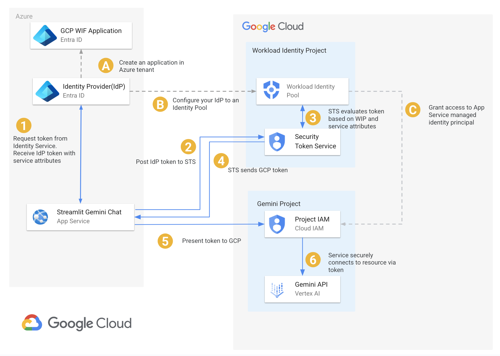

# Terraform Azure Workload Identity Federation
Implementation of [Workload Identity Federation with Azure](https://cloud.google.com/iam/docs/workload-identity-federation-with-other-clouds#azure)

## Architecture


## Configuration

Before running `terraform apply`, you need to set some required variables. The recommended approach is to create a `terraform.tfvars` file in the root of this project.

### Required Variables

*   `tenant_id`: The tenant ID for your Azure AD (Entra ID).
*   `subscription_id`: The subscription ID where Azure resources will be created.
*   `org_id`: The GCP Organization ID where projects will be created.
*   `billing_account_id`: The GCP Billing Account to attach to the projects.
*   `project_prefix`: Unique prefix to apply to created GCP projects
*   `terraform_service_account`: Terraform service account used for impersonation

Create a `terraform.tfvars` file with the following content, replacing the placeholder values:

```hcl
tenant_id                 = "YOUR_AZURE_TENANT_ID"
subscription_id           = "YOUR_AZURE_SUBSCRIPTION_ID"
org_id                    = "YOUR_GCP_ORG_ID"
billing_account_id        = "YOUR_GCP_BILLING_ID"
project_prefix            = "YOUR_GCP_PROJECT_PREFIX"
terraform_service_account = "YOUR_TERRAFORM_SERVICE_ACCOUNT"
```

Alternatively, you can provide variables using environment variables prefixed with `TF_VAR_`. For example: `export TF_VAR_azure_tenant_id="YOUR_AZURE_TENANT_ID"`.

## Apply Terraform
The Terraform configuration creates:
- Dedicated GCP project for the workload identity pool
- GCP project for accessing Gemini via Vertex AI
- Entra ID application and service principal
- Workload identity pool and provider

1. Initialize Terraform:
    ```
    terraform init
    ```
    This command prepares your working directory for Terraform by downloading the necessary providers and modules.

2. Apply the Terraform configuration:
    ```
    terraform apply
    ```
    This command creates or updates resources according to your Terraform configuration. You will be prompted to confirm the actions before they are executed.

## Using with Azure App Service
The Terraform deploys an Azure App Service application that demonstrates how to call Vertex AI using the Google Gen AI SDK with credentials obtained through workload identity federation.

**NOTE:** When running on Azure App Service your credential config will differ as it must dynamically obtain the identity URL from [environment variables](https://learn.microsoft.com/en-us/azure/app-service/overview-managed-identity?tabs=portal%2Cpython#rest-endpoint-reference) for `IDENTITY_ENDPOINT` and `IDENTITY_HEADER`.

Additionally, the sample application in `gemini-streamlit-app` configures the Google Gen AI SDK using environment variables for `GOOGLE_GENAI_USE_VERTEXAI`, `GOOGLE_CLOUD_PROJECT` and `GOOGLE_CLOUD_LOCATION`.

The Terraform output includes the URL of the Azure Service App to validate functionality.

## Using with Azure VMs
Virtual Machines have access to the Azure Instance Metadata Service(`169.254.169.254`) to obtain the credentials unlike the identity URL used by App Service which requires a different credential config.
### Generate credential file
From your local machine generate the credential config file:
```
WIP_PROJECT_NUMBER=$(terraform output -raw wip_project_number)
POOL_ID=$(terraform output -raw pool_id)
PROVIDER_ID=$(terraform output -raw provider_id)
APPLICATION_ID_URI=$(terraform output -raw application_id_uri)

gcloud iam workload-identity-pools create-cred-config \
    projects/$WIP_PROJECT_NUMBER/locations/global/workloadIdentityPools/$POOL_ID/providers/$PROVIDER_ID \
    --azure \
    --app-id-uri $APPLICATION_ID_URI \
    --output-file=credential-config.json
```

### Test with VM
1. Create an Azure VM with a system assigned managed identity.
1. Grant the managed identity access to the Gemini GCP project
    ```bash
    # NOTE: Replace placeholder values for YOUR_AZURE_VM_RESOURCE_GROUP and YOUR_AZURE_VM_NAME
    AZURE_VM_RESOURCE_GROUP=YOUR_AZURE_VM_RESOURCE_GROUP
    AZURE_VM_NAME=YOUR_AZURE_VM_NAME
    MANAGED_IDENTITY=$(az vm show --resource-group $AZURE_VM_RESOURCE_GROUP --name $AZURE_VM_NAME --query identity.principalId -o tsv)
    WIP_PROJECT_NUMBER=$(terraform output -raw wip_project_number)
    POOL_ID=$(terraform output -raw pool_id)
    GEMINI_PROJECT_ID=$(terraform output -raw gemini_project_id)
    gcloud projects add-iam-policy-binding $GEMINI_PROJECT_ID \
        --member="principal://iam.googleapis.com/projects/$WIP_PROJECT_NUMBER/locations/global/workloadIdentityPools/$POOL_ID/subject/$MANAGED_IDENTITY" \
        --role="roles/aiplatform.user"
    ```
1. SSH into an Azure VM.
1. [Install](https://cloud.google.com/sdk/docs/install) the Google Cloud CLI
1. Add the credential file(`credential-config.json`) to the VM
1. Authenticate gcloud with the credential file.
    ```
    gcloud auth login --cred-file=credential-config.json
    ```
1. Validate access to the GCP project
    Use the credential file to [access Google Cloud](https://cloud.google.com/iam/docs/workload-identity-federation-with-other-clouds#cred-config-access)
    ```
    # NOTE: Replace placeholder values for YOUR_GEMINI_PROJECT_ID
    gcloud ai model-garden models list --project=YOUR_GEMINI_PROJECT_ID
    ```
